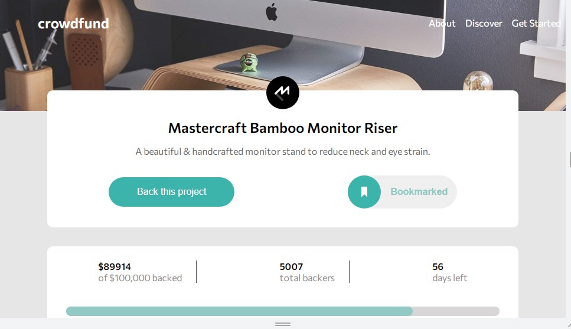

# Frontend Mentor - Crowdfunding product page solution

This is a solution to the [Crowdfunding product page challenge on Frontend Mentor](https://www.frontendmentor.io/challenges/crowdfunding-product-page-7uvcZe7ZR). Frontend Mentor challenges help you improve your coding skills by building realistic projects.

## Table of contents

- [Overview](#overview)
  - [Screenshot](#screenshot)
  - [Links](#links)
- [My process](#my-process)
  - [Built with](#built-with)
  - [What I learned](#what-i-learned)
  - [Continued development](#continued-development)
  - [Useful resources](#useful-resources)
- [Author](#author)
- [Acknowledgments](#acknowledgments)

## Overview

### Screenshot



### Links

- Solution URL: [https://www.frontendmentor.io/solutions/crowdfunding-product-page-challenge-hub-with-html-css-and-javascript-Id_VynCAX](https://www.frontendmentor.io/solutions/crowdfunding-product-page-challenge-hub-with-html-css-and-javascript-Id_VynCAX)
- Live Site URL: [https://ejim11.github.io/Crowdfunding-site/](https://ejim11.github.io/Crowdfunding-site/)

## My process

### Built with

- Semantic HTML5 markup
- CSS custom properties
- Flexbox
- Javascript

### What I learned

- I had more understanding on structuring the page with new html semantics

```html
<main>
  <!-- mastercraft section starts, first section of the main section -->
  <section class="mastercraft sections-general">....</section>
</main>
```

- I learnt a lot on css group classes and its selectors

```css
.offers {
  border: 1px solid rgb(148, 141, 141);
  padding: 1rem 1rem;
  margin: 0.5rem 0;
  border-radius: 1rem;
}
....
}
```

- I understood more on the concept of DOM manipulation
- I also got more ideas on how to loop through the DOM

```js
// adding function to the exit button in the back this project page
// creating and storing  a variable holding the exit btn dom element in the back this project modal
const exitPledgePageBtn = document.querySelector(".exit");
// adding an event listerner to the exit btn

exitPledgePageBtn.addEventListener("click", function () {
  pledgePage.classList.add("hide");
  overlay.classList.add("hidden");
  // looping through all the checkboxes to uncheck and restore to default when the exit btn is clicked
  for (let i = 0; i < checkBox.length; i++) {
    checkBox[i].checked = false;
    offersModal[i].classList.remove("border-color");
    moneyPledgeDiv[i].classList.add("hide");
  }
});
```

### Continued development

- Css and its pre-processors(SASS)
- Javascript (DOM manipulation, eventlisterners, functions, loops, arrays and objects)

### Useful resources

- [Example resource 1](https://codepen.io/aaroniker/pen/PowZbgb) - This helped me in understanding styling of checkboxes more
- [Example resource 2](https://stackoverflow.com/questions/1144805/scroll-to-the-top-of-the-page-using-javascript) -This contained code that helped me in understanding DOM manipulation.

## Author

- Frontend Mentor - [@ejim11](https://www.frontendmentor.io/profile/ejim11)
- Twitter - [@favourejim56](https://www.twitter.com/favourejim56)

## Acknowledgments

- I acknowledge my good friend Akay and stackoverflow for their immense help...
